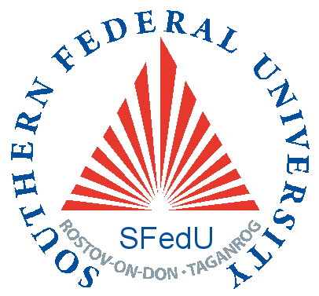

I am a **postdoc** at {{site.data.links.mdlinks.purdue}} (West Lafayette, IN, USA).
I work with {{site.data.links.mdlinks.suresh}}
at {{site.data.links.mdlinks.purpl}}, the Purdue University Programming Language Group,
starting September 2023.

My research focuses on **programming languages**, in particular,
their design, semantics, and correctness.
Recently, I have been working on program analysis techniques for combining
over- and under-approximate reasoning in the context of symbolic execution.
My thesis work was about formalizing aspects of
the {{site.data.links.mdlinks.julialang}} language.  



&#127482;&#127462; **As a Russian national, I strongly condemn the war started by the Russian government in Ukraine on February 24th, 2022.**

### Contacts

**Email**: [julbinb@gmail.com](mailto:julbinb@gmail.com) (preferred)
or [ybelyako@purdue.edu](mailto:ybelyako@purdue.edu)  
Professional: [github]({{site.github.account}}),
[researchgate]({{site.researchgate}}), [linkedin]({{site.linkedin}})  
Social: [twitter]({{site.twitter}}), [facebook]({{site.facebook}})  
**Current location** (as of 2024): Lafayette, IN, USA  
**Office**: 3154C, [Lawson Computer Science Building](https://maps.app.goo.gl/1vUMvpQ6jUNj8AYJ8)  
**Book a meeting**: [calendly](https://calendly.com/julbinb/meeting)
<!--[skype](skype:juliet_belyakova)-->  
<!--Web-page in Russian:
[staff.mmcs.sfedu.ru](http://staff.mmcs.sfedu.ru/~juliet/index.html).-->

<!-- #### Questions, comments, feedback -->

> If you have any questions or comments—about projects, papers,
> or anything else mentioned on the website
> (e.g. international student experience, being a woman
> in CS)—{{site.contactmetext}}

### Short bio ([full bio](bio), [personal](personal))

I was born in 1991 in Russia, Rostov-on-Don, where I also grew up
and received education.
In 2012–2016, I was teaching undergraduate CS courses at my alma mater,
{{site.data.links.mdlinks.mmcs}} ({{site.data.links.mdlinks.sfedu}}).  
While teaching half-time, I had entered a PhD program as well
but later moved to [Northeastern]({{site.data.links.places.neu.link}})
where my PhD journey started over.  
In 2017–2018, I spent a year at the {{site.data.links.mdlinks.fitcvut}}
({{site.data.links.mdlinks.cvut}}) doing research
with {{site.data.links.mdlinks.janvitek}}.  
In 2018–2023, I continued working with {{site.data.links.mdlinks.janvitek}}
during my PhD at {{site.data.links.mdlinks.khoury}}
({{site.data.links.mdlinks.neu}}) in Boston.  
In 2023, I started a postdoc with {{site.data.links.mdlinks.suresh}}
at {{site.data.links.mdlinks.purpl}} ({{site.data.links.mdlinks.purdue}}).

<!--
> If you have questions about doing a PhD in the US,
> being an international student, woman in CS, etc.,
> feel free to contact me.
-->

### Recent professional [news](news) (without [failures](failures))

* Nov 2024: accepted paper at
  [POPL 2025](https://popl25.sigplan.org/)  
  [Derivative-Guided Symbolic Execution](/papers#popl2025)

* Aug 2024: joined the Review Committee of
  [OOPSLA 2025](https://2025.splashcon.org/track/OOPSLA)

* Apr 2024: accepted paper at
  [PLDI 2024](https://pldi24.sigplan.org/)  
  [Decidable Subtyping of Existential Types for Julia](/papers#pldi2024)

* Apr 2024: joined the Program Committee of
  [Scheme 2024](https://icfp24.sigplan.org/home/scheme-2024)

* Feb 2024: joined the Program Committee of
  [TyDE 2024](https://icfp24.sigplan.org/home/tyde-2024)

* Jan 2024: joined the Program Committee of
  [ARRAY 2024](https://pldi24.sigplan.org/home/ARRAY-2024)

* Nov 2023: talk at [PurPL Seminar](https://purduepl.github.io/seminars.html)  
  [Julia: Practical Restrictions for a Scientific-Computing Language](/talks#purpl2023)

* Aug 2023: defended my PhD thesis at {{site.data.links.mdlinks.neu}}  
  [Decidable Subtyping of Existential Types for the Julia Language](/papers#phdthesis)

## Research






My research largely focuses on the design, semantics, and correctness
of programming languages.
In particular, I am interested in making it easier for language users
to understand the semantics of their programming language
and write robust and correct software.
My research interests also include type systems, compilers,
software correctness, program analysis,
theorem proving (most of my experience has been with
{{site.data.links.mdlinks.coq}}),
generic programming (like Java generics or ML polymorphism),
programming by contracts, software testing,
human aspects of programming languages and software engineering,
and CS education.

Most recently, I have been working on program analysis,
in particular, on extending symbolic execution with symbolic finite automata
([POPL 2025](/papers#popl2025)) and enabling symbolic execution to reason
about over-approximate information (work in progress).

During my PhD, I worked on formalizing
various aspects of the {{site.data.links.mdlinks.julialang}}
programming language:

* The notion of [type stability]({{site.data.links.websites.typestability}})
  and its impact on JIT compilation in [Jules](/projects/jules)
  [[OOPSLA 2021](/papers#oopsla2021)].
* The semantics of
  [world age]({{site.data.links.websites.worldage}})
  and its interaction with `eval`
  in a core calculus [Juliette](/projects/juliette)
  [[OOPSLA 2020](/papers#oopsla2020)].
* The subtyping relation.
  - A reconstruction of subtyping in
    [LambdaJulia](/projects/lambda-julia) [[OOPSLA 2018](/papers#oopsla2018)].
  - A semantic subtyping model suitable for a dynamic programming language
    [[FTfJP 2019](/papers#ftfjp2019), 
    [Appendix A.2 of PhD thesis](https://julbinb.github.io/papers#phdthesis)].
  - Decidable subtyping
    [[PhD thesis](https://julbinb.github.io/papers#phdthesis)]
    [[PLDI 2024](/papers#pldi2024)]

> <small>_Disclaimer._ Good or bad, the language has nothing to do with me, and our shared name is a coincidence!</small>

My previous research was related to language support for generic programming
in object-oriented languages
[[SBLP 2016](/papers#sblp2016), [SYRCoSE 2015](/papers#syrcose2015)].

### Selected papers and talks

1. 
1. 
1. 
1. 
1. 
1. 
1. 
